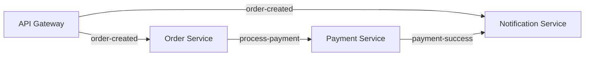

# Kafka Monorepo - Sistema de Microservicios

<a alt="Nx logo" href="https://nx.dev" target="_blank" rel="noreferrer"></a>

Un monorepo construido con **NestJS** y **Apache Kafka** que implementa una arquitectura de microservicios para procesar órdenes, pagos y notificaciones de manera asíncrona.

## 🏗️ Arquitectura

Este proyecto demuestra un sistema distribuido escalable usando patrones de arquitectura basada en eventos con los siguientes componentes:

### Servicios

- **🔧 API Gateway** (`api-gateway`): Punto de entrada principal que recibe solicitudes HTTP y las publica en Kafka
- **📦 Order Microservice** (`order-microservice`): Procesa las órdenes creadas y las envía al servicio de pagos
- **💳 Payment Microservice** (`payment-microservice`): Maneja el procesamiento de pagos y confirma transacciones
- **📧 Notification Microservice** (`notification-microservice`): Envía notificaciones cuando ocurren eventos importantes

### Flujo de Trabajo

```
Cliente → API Gateway → Kafka → Order Service → Payment Service → Notification Service
                         ↓           ↓              ↓
                    order-created → process-payment → payment-success
```

1. Un cliente envía una orden al API Gateway via POST `/order`
2. El Gateway publica el evento `order-created` en Kafka
3. El Order Service recibe el evento y emite `process-payment`
4. El Payment Service procesa el pago y emite `payment-success`
5. El Notification Service envía confirmaciones en cada paso del proceso

## 🛠️ Tecnologías

- **[NestJS](https://nestjs.com/)** - Framework progresivo para Node.js
- **[Apache Kafka](https://kafka.apache.org/)** - Plataforma de streaming distribuido
- **[KafkaJS](https://kafka.js.org/)** - Cliente moderno de Kafka para Node.js
- **[Nx](https://nx.dev/)** - Herramientas de desarrollo para monorepos
- **[Docker Compose](https://docs.docker.com/compose/)** - Orquestación de contenedores

## 🚀 Inicio Rápido

### Prerequisitos

- Node.js (v18 o superior)
- Docker y Docker Compose
- npm o yarn

### Instalación

1. **Clonar el repositorio**
   ```bash
   git clone <repository-url>
   cd kafka-monorepo
   ```

2. **Instalar dependencias**
   ```bash
   npm install
   ```

3. **Iniciar Kafka y Zookeeper**
   ```bash
   docker-compose up -d
   ```

4. **Ejecutar los servicios**
   ```bash
   # API Gateway
   npx nx serve api-gateway
   
   # Order Microservice
   npx nx serve order-microservice
   
   # Payment Microservice
   npx nx serve payment-microservice
   
   # Notification Microservice
   npx nx serve notification-microservice
   ```

### Prueba del Sistema

Envía una orden para probar el flujo completo:

```bash
curl -X POST http://localhost:3000/order \
  -H "Content-Type: application/json" \
  -d '{
    "id": "12345",
    "product": "Laptop",
    "amount": 999.99,
    "customer": "john@example.com"
  }'
```


Verás los logs en cada microservicio mostrando el flujo de eventos.

## 📋 Comandos Disponibles

### Desarrollo

```bash
# Ejecutar un servicio específico
npx nx serve <service-name>

# Ejemplos:
npx nx serve api-gateway
npx nx serve order-microservice
npx nx serve payment-microservice
npx nx serve notification-microservice
```

### Build y Testing

```bash
# Crear build de producción
npx nx build <service-name>

# Ejecutar tests
npx nx test <service-name>

# Ejecutar tests e2e
npx nx e2e <service-name>-e2e

# Ver todos los targets disponibles
npx nx show project <service-name>
```

### Nx Utilities

```bash
# Visualizar el gráfico de dependencias
npx nx graph

# Ejecutar comandos en paralelo
npx nx run-many --target=build --all

# Generar nueva aplicación
npx nx g @nx/nest:app <app-name>

# Generar nueva librería
npx nx g @nx/nest:lib <lib-name>
```

## 🔧 Configuración

### Variables de Entorno

Cada microservicio puede configurarse mediante variables de entorno:

```bash
# Kafka Configuration
KAFKA_BROKERS=localhost:9092
KAFKA_CLIENT_ID=microservice-name

# Service Ports
API_GATEWAY_PORT=3000
ORDER_SERVICE_PORT=3001
PAYMENT_SERVICE_PORT=3002
NOTIFICATION_SERVICE_PORT=3003
```

### Docker Compose

El archivo `docker-compose.yml` incluye:
- **Zookeeper**: Coordinación de Kafka (puerto 2181)
- **Kafka**: Broker de mensajes (puerto 9092)

## 📁 Estructura del Proyecto

```
kafka-monorepo/
├── apps/
│   ├── api-gateway/              # Gateway HTTP REST
│   ├── order-microservice/       # Procesamiento de órdenes
│   ├── payment-microservice/     # Procesamiento de pagos
│   ├── notification-microservice/ # Sistema de notificaciones
│   └── *-e2e/                   # Tests end-to-end
├── libs/                         # Librerías compartidas
├── docker-compose.yml            # Configuración de Kafka
└── nx.json                       # Configuración de Nx
```

## 📚 Eventos de Kafka

### Eventos Publicados

| Evento | Publicado por | Consumido por | Payload |
|--------|---------------|---------------|---------|
| `order-created` | API Gateway | Order Service, Notification Service | Order data |
| `process-payment` | Order Service | Payment Service | Order data |
| `payment-success` | Payment Service | Notification Service | Payment data |

### Flujo de Mensajes



## 🤝 Contribución

1. Fork el proyecto
2. Crea una rama para tu feature (`git checkout -b feature/nueva-funcionalidad`)
3. Commit tus cambios (`git commit -m 'Añadir nueva funcionalidad'`)
4. Push a la rama (`git push origin feature/nueva-funcionalidad`)
5. Abre un Pull Request

## 📄 Licencia

Este proyecto está bajo la Licencia MIT - ver el archivo [LICENSE](LICENSE) para más detalles.

---

**✨ Desarrollado con Nx Workspace - Herramientas de desarrollo de próxima generación para monorepos ✨**
